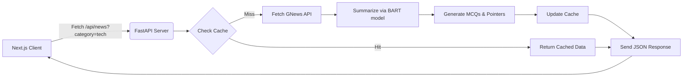
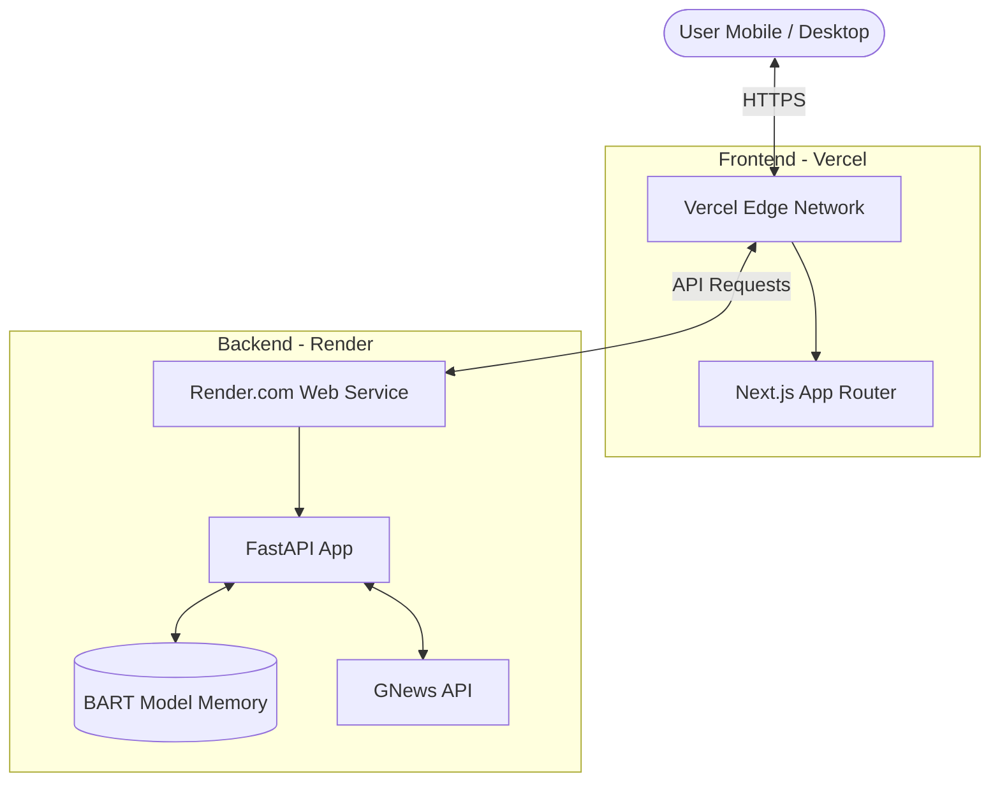
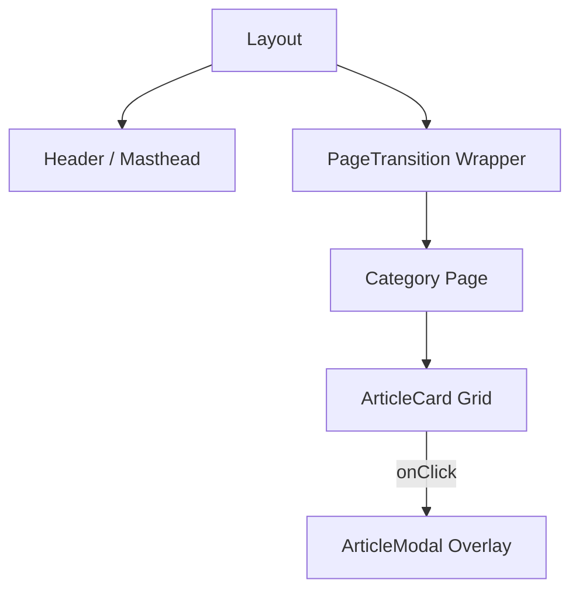

# TOI News Summariser (1970s Edition)

An elegant, vintage 1970s broadsheet newspaper web application that fetches Times of India news, summarizes them using robust AI (HuggingFace BART), and provides exam preparation features like MCQ and Quick Pointers.

## Technology Stack
- **Frontend**: Next.js 14, React 18, Tailwind CSS, Framer Motion
- **Backend API**: Python, FastAPI, HuggingFace Transformers
- **Integration**: GNews API

## Project Highlights
- **1970s Aesthetic**: Uses immersive broadsheet styles, Playfair Display mastheads, IM Fell drop caps, detailed CSS paper noise filters, and halftone effects.
- **Micro-Animations**: Framer Motion powers a 3D page flip experience when navigating sections and interactive `rotate+scale` newspaper clipping article views.
- **AI-Powered API**: Generates abstractive and extractive summaries on the backend, creating MCQs and "Quick Pointers" on the fly for competitive exam preparations. 

---

## 🚀 Running Your Application Locally

You will need to run the Frontend and the Backend simultaneously in terminal windows. 

### 1. Backend (FastAPI API)
Open a terminal in the root folder (`news-summarizer/`):
```bash
# 1. Ensure you are in the root directory
cd news-summarizer

# 2. Install Python dependencies 
pip install -r requirements.txt

# 3. Start the FastAPI server (Hot reload enabled)
uvicorn main:app --reload --port 8000
```
*Note: Make sure your `GNEWS_API_KEY` is present. Alternatively export it before step 3: `export GNEWS_API_KEY=your_api_key_here`.*

### 2. Frontend (Next.js Application)
Open a *new* terminal window:
```bash
# 1. Navigate to the frontend directory
cd news-summarizer/frontend

# 2. Install Node dependencies
npm install

# 3. Start Next.js Development Server
npm run dev
```

Visit the app at [http://localhost:3000](http://localhost:3000)

---

## 🌍 Deployment Instructions

### 1. Deploying the Backend on Render.com (Free Tier Option)
Render is an excellent platform for hosting FastAPI Python applications.
1. Push this repository to GitHub. 
2. Log into [Render](https://render.com/).
3. Click **New +** and select **Web Service**.
4. Connect the GitHub repository.
5. Setup the environment:
   - Environment: `Python 3`
   - Build Command: `pip install -r requirements.txt`
   - Start Command: `uvicorn main:app --host 0.0.0.0 --port 10000`
6. Under Advanced Settings, add your environment variable: 
   - Key: `GNEWS_API_KEY` => Value: `your_api_key_here`
7. Click **Create Web Service**. Wait for the API to go live and grab your Backend API URL (e.g., `https://news-backend-xyz.onrender.com`).

### 2. Deploying the Frontend on Vercel
Vercel handles Next.js apps seamlessly and efficiently.
1. Log into [Vercel](https://vercel.com).
2. Click **Add New...** -> **Project**.
3. Import your GitHub repository.
4. **Important Framework settings:** 
   - Framework Preset: `Next.js`
   - Root Directory: *Click `Edit` and select `frontend/`*
5. Add the Environment Variable. 
   - Key: `NEXT_PUBLIC_API_URL` => Value: `your_render_backend_url_here` (from Step 1)
6. Click **Deploy**. Vercel will instantly generate a public URL.

## Features Summary
- **Section Mastheads**: Bold 1970s print navigation (Business, Politics, Tech, Sports, etc.).
- **Newspaper Grid**: Articles fade in sequentially via Intersection Observer API.
- **Article Clippers (Modals)**: Styled like a real torn newspaper clip using CSS clip-paths.
- **BART Model Caching**: Uses `@asynccontextmanager` in FastAPI instead of `@st.cache_resource` for streamlined LLM startup checks.
- **Daily Persistence**: Caching to prevent redundant LLM and GNews requests.

## SECTION 7: TECHNICAL ARCHITECTURE

### 7.1 Tech Stack
-   **Frontend:** Next.js 14 (App Router), React 18, TailwindCSS, Framer Motion
-   **Backend:** FastAPI, Python, HuggingFace Transformers (BART)
-   **Data Storage/Caching:** Local JSON file-based cache (`cache.json`)
-   **News API:** GNews API integration

### 7.2 Frontend File Structure
```text
frontend/
├── app/
│   ├── [category]/
│   │   └── page.js          # Dynamic category pages (Politics, Tech, etc.)
│   ├── layout.js            # Main layout wrapper
│   ├── page.js              # Home page (Top News)
│   └── globals.css          # Tailwind and custom 1970s CSS styles
├── components/
│   ├── ArticleCard.js       # Newspaper-style grid item
│   ├── ArticleModal.js      # Detailed view with summary and exam prep
│   ├── Header.js            # Masthead, Date, categories navigation
│   ├── PageTransition.js    # Framer Motion 3D page flip wrapper
│   └── Loader.js            # Typewriter/Halftone style loader
├── public/
│   └── paper-texture.png    # Background noise/paper overlay
├── package.json
└── tailwind.config.js
```

### 7.3 Backend API Structure
```text
news-summarizer/
├── main.py                  # FastAPI application entry point 
├── requirements.txt         # Python dependencies
├── cache.json               # Auto-generated daily cache 
└── .env                     # Contains GNEWS_API_KEY
```

### 7.4 Data Flow Diagram


### 7.5 Deployment Architecture


---

## SECTION 8: BACKEND IMPLEMENTATION DETAILS

### 8.1 FastAPI Endpoints Table

| Endpoint | Method | Parameters | Description | Response Format |
| :--- | :--- | :--- | :--- | :--- |
| `/` | `GET` | None | Health check & model status | `{"status": "ok", "message": "..."}` |
| `/api/news` | `GET` | `category` (str), `max_results` (int, default=10) | Fetches news, summarizes, generates MCQs for a category | List of Article Objects (JSON) |

### 8.2 Database/Caching Strategy
To avoid exhausting the GNews API limits and significantly reduce LLM inference times, the app uses a daily JSON file cache (`cache.json`).
-   On request, the backend checks for a key in format `{category}_{current_date}`.
-   If the cache hits, it skips external API and model inference entirely.
-   If it misses, it fetches data, summarizes it, generates MCQs, saves it to `cache.json`, and then serves the payload.

### 8.3 BART Model Loading & Optimization
The BART model (`facebook/bart-large-cnn`) is heavy. To prevent the API from reloading the model on every request, we use `contextlib.asynccontextmanager`:
-   The model is loaded into memory only once during the FastAPI app startup phase (`lifespan` event).
-   The tokenizer and pipeline are shared globally for inference, significantly speeding up subsequent text generations.

### 8.4 Error Handling & Fallbacks
-   **GNews API Errors:** If GNews quota is exceeded, the server returns a `502 Bad Gateway` standard error. 
-   **Summarization Failures:** If the model fails, the system safely falls back to returning the article's existing abstract description without crashing the request.
-   **Empty Results:** Returns empty arrays `[]` without triggering unhandled exceptions.

### 8.5 CORS Configuration for Frontend
The backend is configured using FastAPI's `CORSMiddleware`.
-   **Allowed Origins:** Fully permissive during development (`*` or `http://localhost:3000`), restricted to the Vercel domain during production.
-   **Allowed Methods/Headers:** Restricts allowed headers/methods (`GET`, `OPTIONS`) to secure the API.

### 8.6 Environment Variables
-   `GNEWS_API_KEY`: Required to access the GNews API. 
The application accesses this variable securely using Python's `os.environ.get()` mapping to `.env` or system environment bindings on Render.com.

---

## SECTION 9: FRONTEND COMPONENT SPECIFICATIONS

### 9.1 Component Hierarchy Diagram


### 9.2 Masthead Component
-   **Role:** Site branding and primary navigation.
-   **Typography:** Playfair Display for the main title, reflecting a broadsheet newspaper heading.
-   **State:** Uses Next.js `usePathname` to detect active category and applies an underline effect.
-   **Styling:** Sticky header, thick double-lined solid border beneath (`border-b-4 border-double border-gray-900`) for the vintage impression.

### 9.3 ArticleCard Component
-   **Role:** Gridded display of news articles.
-   **Layout:** Masonry or standard CSS grid, varying image positions (top vs inline).
-   **Typography:** IM Fell French Canon for headlines, serif for body text. Creates a drop-cap effect for the first letter of the description.
-   **Behavior:** Scale slightly on hover. Triggers the modal on click.

### 9.4 ArticleModal Component
-   **Role:** Detailed reader view for a single summarized article + Exam Prep modules (MCQs/Quick Pointers).
-   **Structure:** Uses typical modal dialog (`div` container centered with backdrop). Contains tabs or accordions separating "Summary" and "Exam Prep".
-   **Animations:** Uses Framer Motion's `AnimatePresence`. Enters with `scale: 0.9` to `1` and fades in. Features CSS `clip-path` for torn edge aesthetic.
-   **Close Behavior:** Dismissed on clicking the outside backdrop or pressing the Escape key.

### 9.5 PageTransition Wrapper
-   **Role:** Surrounds the Next.js `children` to provide fluid page turning.
-   **Framer Motion Config:** Uses a 3D rotate effect.
    -   `initial`: `{ opacity: 0, rotateY: 90, scale: 0.9 }`
    -   `animate`: `{ opacity: 1, rotateY: 0, scale: 1 }`
    -   `exit`: `{ opacity: 0, rotateY: -90, scale: 0.9 }`
-   **Result:** A tactile flipping of broadsheet wings.

### 9.6 Shared Components
-   **Header:** Maintained across all pages. Contains logic to format and display the current date in vintage format ("Monday, April 13, 2026").
-   **BackButton/Footer:** Subtle print-style stamps or navigation controls ensuring a clean UI without disrupting the 1970s aesthetic.