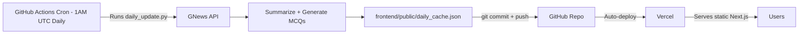

# TOI News Summariser (1970s Edition)

An elegant, vintage 1970s broadsheet newspaper web application that fetches Times of India news, summarizes them using AI (HuggingFace DistilBART), and provides exam preparation features like MCQs and Quick Pointers.

## Architecture

This app uses a **static JSON + GitHub Actions** architecture for zero-cost, high-performance deployment:



- **No backend server needed** — the frontend reads a static JSON file
- **GitHub Actions** fetches news daily, generates summaries, and commits the updated JSON
- **Vercel** auto-deploys on every push, serving the Next.js frontend instantly

## Technology Stack

| Layer | Tech |
|-------|------|
| Frontend | Next.js 14, React 18, Tailwind CSS, Framer Motion |
| Summarization | Python, HuggingFace Transformers (DistilBART) |
| News Source | GNews API |
| Automation | GitHub Actions (daily cron) |
| Hosting | Vercel (frontend), GitHub (data storage) |

## Project Structure

```
news-summarizer/
├── .github/workflows/
│   └── daily_update.yml        # Cron job: fetches + summarizes news daily
├── frontend/
│   ├── app/
│   │   ├── [category]/page.js  # Dynamic category pages
│   │   ├── layout.js           # Root layout with vintage fonts
│   │   ├── page.js             # Homepage — section navigation
│   │   ├── template.js         # Framer Motion 3D page-flip wrapper
│   │   └── globals.css         # Tailwind + paper texture overlay
│   ├── components/
│   │   ├── ArticleCard.js      # Newspaper-style article with drop cap
│   │   └── ArticleModal.js     # Torn-paper modal with summary + exam prep
│   ├── public/
│   │   └── daily_cache.json    # Auto-updated news data (committed by CI)
│   ├── tailwind.config.js      # Vintage color palette + typography
│   ├── package.json
│   └── next.config.mjs
├── daily_update.py             # Script: fetch news, summarize, write JSON
├── requirements.txt            # Python deps for daily_update.py
└── README.md
```

## Design Highlights

- **1970s Broadsheet Aesthetic**: Playfair Display mastheads, IM Fell drop caps, Crimson Text body, paper noise SVG overlay
- **Micro-Animations**: Framer Motion 3D page-flip transitions, staggered article fade-ins, spring-animated modals
- **Torn Paper Modals**: CSS `clip-path` creates a realistic torn newspaper clipping effect
- **Exam Prep Features**: Each article includes AI-generated MCQs, Quick Pointers, and Exam Context explanations

## Deployment

### Frontend on Vercel
1. Log into [Vercel](https://vercel.com)
2. Import the GitHub repository
3. Set **Root Directory** to `frontend/`
4. Framework Preset: `Next.js`
5. Deploy — Vercel auto-deploys on every push

### Daily Updates via GitHub Actions
The workflow runs automatically at **1AM UTC daily**. To configure:
1. Add your GNews API key as a GitHub Secret: `GNEWS_API_KEY`
2. The workflow is in `.github/workflows/daily_update.yml`
3. You can also trigger it manually via the **Actions** tab → **Run workflow**

### Running Locally

```bash
# Frontend
cd frontend
npm install
npm run dev
# Visit http://localhost:3000

# Manual data update (optional)
pip install -r requirements.txt
export GNEWS_API_KEY=your_key_here
python daily_update.py
```

## Features

- **Section Navigation**: Bold 1970s print-style category cards (National, Business, Politics, Tech, Sports, International, Editorial)
- **Newspaper Grid**: Articles appear with staggered animations via Intersection Observer
- **Article Clippers**: Torn-paper modals with abstractive summaries, quick pointers, MCQs, and exam context
- **Daily Persistence**: GitHub Actions commits fresh data daily — no API calls at runtime
- **Responsive Design**: Fully responsive from mobile to widescreen